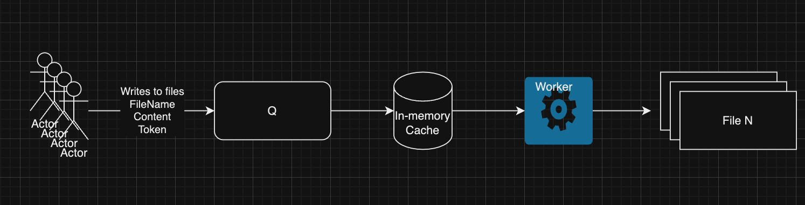

Реализация многопользовательской системы чтения/записи с кешированием 

## Условия задачи

Компоненты системы:

1. **Каналы для записи сообщений**: Несколько пользователей передают изменения для записи в файлы через каналы.
1.1 Пользователей можно сэмулировать обычным циклом
2. **Кеширование сообщений**: Сообщения из каналов кешируются.
3. **Воркер**: Воркер проходит по кешу и каждые секунду записывает изменения в соответствующие файлы.
4. **Валидация токенов**: Если сообщение приходит от пользователя с неправильным токеном, оно не должно быть записано.
5. **Graceful Shutdown**. При остановке приложения все закешированные данные должны записаться в файл

## Требования

1. **Структура данных для сообщений**:
   - Каждое сообщение должно содержать идентификатор пользователя, токен, идентификатор файла и данные для записи.
   - Пример структуры для сообщения:
     ```go
     type Message struct {
       Token     string
       FileID    string
       Data      string
     }
     ```

2. **Кеширование сообщений**:
   - Реализуйте обработчик, который будет вычитывать данные из каналов и помещать их в кеш, если токен пользователя валидный.
   - Используйте map для хранения сообщений в кеше. Ключом служит идентификатор файла, а значением список сообщений.

3. **Валидация токенов**:
   - Создайте функцию или метод для проверки токенов пользователей. Храните допустимые токены(white-list) в специальной структуре

4. **Воркер для записи данных в файлы**:
   - Воркер должен периодически (раз в секунду и задается с конфига) проходить по кешу и записывать все изменения в соответствующие файлы.
   - После записи кеш для этих файлов должен быть очищен.


## Cхема




## Cценарии (можно и тестики по ним написать)

### Сценарий 1: Успешная запись
1. Пользователь отправляет сообщение с правильным токеном в канал записи.
2. Сообщение кешируется.
3. Воркер через заданный интервал времени (секунда) берет сообщение из кеша.
4. Воркер записывает сообщение в целевой файл.
5. Кеш очищается для этого файла.

### Сценарий 2: Неверный токен
1. Пользователь отправляет сообщение с неправильным токеном в канал записи.
2. Сообщение проверяется на валидность токена.
3. Сообщение не кешируется и отбрасывается.

### Сценарий 3: Остановка приложения (Graceful Shutdown)
1. Приложение получает сигнал остановки.
2. Воркер проходит по кешу и записывает все оставшиеся сообщения в соответствующие файлы.
3. Приложение завершает работу.

### Сценарий 4: Высокая нагрузка
1. Пользователи массово отправляют сообщения в каналы записи.
2. Обработчики записывают сообщения в кеш.
3. Воркер масштабируется

### Cценарий 5: Файл с одновременной записью
1. Корректная запись данных в один и тот же файл, когда несколько пользователей одновременно отправляют сообщения для него.
2. Синхронизация, чтобы избежать конфликтов и потери данных.

### Cценарий 6: Сбор работы воркера
1. Если воркер сталкивается с ошибкой при записи данных в файл (недоступность файла, отказ диска, etc), система должна предпринять меры по обработке этой ситуации.
2. Ретраи, получается